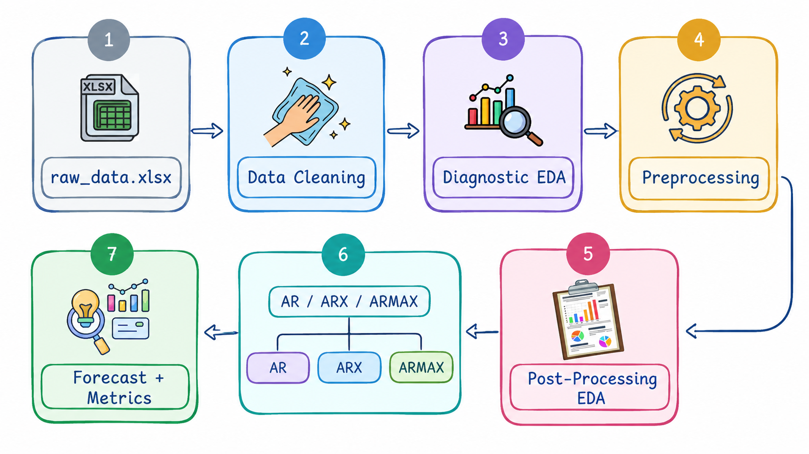
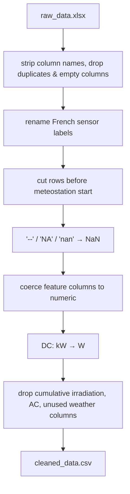
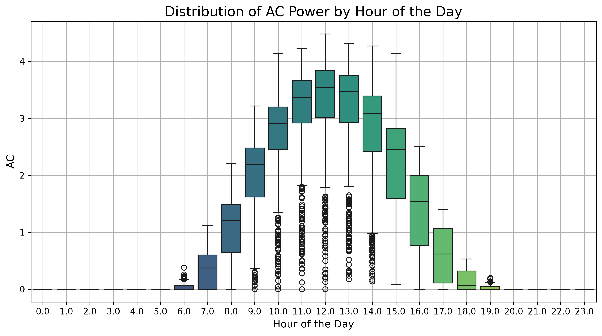
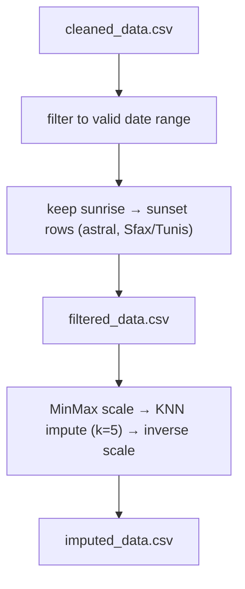

# ☀️ Solar Forecasting Research Pipeline

Experimental forecasting work for solar plant **DC power** generation, built around a clean data pipeline, exploratory analysis, and time-series modeling.


---

## 🧭 Project focus

The goal is to forecast **DC power output** from plant-sensor and weather data through a repeatable pipeline:

raw export → cleaning → exploratory analysis → preprocessing → post-processing EDA → forecasting (AR / ARX / ARMAX)



Each step is captured in a numbered notebook under `notebooks/`, and the notebooks are intentionally designed to be run sequentially so each stage builds on the previous output. The active workflow includes the main exploratory and forecasting notebooks, while the draft notebooks under `notebooks/drafts/` are ignored by the project git settings and are not part of the main documented pipeline.

The raw export combines plant-side inverter/sensor readings (in French) with an hourly weather feed (wind, humidity, temperature, precipitation, dew point, particulate matter, pollen, etc.). Only a subset of the weather columns survives cleaning — the rest are dropped as not relevant to the target.

| # | Notebook | Input | Output |
|---|----------|-------|--------|
| 1 | `1_Data_Cleaning.ipynb` | `data/raw_data.xlsx` | `data/cleaned_data.csv` |
| 2 | `2_Diagnostic_EDA.ipynb` | `data/cleaned_data.csv` | analysis notes / plots (no files saved) |
| 3 | `3_Preprocessing.ipynb` | `data/cleaned_data.csv` | `data/filtered_data.csv`, `data/imputed_data.csv` |
| 4 | `4_Post_Processing_EDA.ipynb` | `data/imputed_data.csv` | figures in `figures/` |
| 5 | `5_AR.ipynb` | `data/imputed_data.csv` | AR forecast + metrics, `models/ar_model.pkl` |
| 6 | `6_ARX.ipynb` | `data/imputed_data.csv` | ARX forecast + metrics, `models/arx_model.pkl` |
| 7 | `7_ARMAX.ipynb` | `data/imputed_data.csv` | ARMAX forecast + metrics, `models/armax_model.pkl` |

> ⚠️ The raw export is not stored in this repository. Add your own `raw_data.xlsx` under `data/` before running notebook 1.
> The `notebooks/drafts/` folder is intentionally excluded from the main workflow and is not part of the active path.

---

## 1️⃣ Data cleaning — raw signals to a usable table

`1_Data_Cleaning.ipynb` loads `data/raw_data.xlsx` (skipping the first header row) and normalizes it into a consistent time-series table:

- strip whitespace from column names
- drop duplicate rows and columns that are entirely empty
- rename the French plant-sensor labels into readable English names (see table below)
- parse the timestamp column and drop rows recorded before the on-site meteostation started operating (`2024-05-18 11:00:00`)
- replace placeholder strings (`--`, `NA`, `NaN`, `nan`) with proper `NaN`
- coerce the feature columns to numeric, normalizing decimal commas to decimal points along the way
- convert `DC` from kW to W
- drop columns that aren't needed for modeling — the raw cumulative daily-irradiation reading, the `AC` power reading, and a long list of unused weather fields (cloud cover, individual pollutant/pollen concentrations, wind gusts/direction at 100 m, etc.)

| Original column | Renamed to |
|---|---|
| `Heure` | `Timestamp` |
| `Angle du vent(°)` | `Wind_Dir_deg` |
| `Vitesse vent(m/s)` | `Wind_Speed_ms` |
| `Humidité ambiante(%RH)` | `Humidity_pct` |
| `Température ambiante(℃)` | `Outdoor_Temp_C` |
| `Temp. (module PV)(℃)` | `PV_Temperature` |
| `Irradiation journalière pente(Wh/㎡)` | `Daily_Irradiation_Cumulated` *(dropped after renaming — not used downstream)* |
| `Irradiation transitoire pente(W/㎡)` | `Solar_Radiation_Wm2` |
| `Inverter1/Puissance active totale (kW)` | `AC` *(dropped — not the forecasting target)* |
| `Inverter1/Puissance DC totale (kW)` | `DC` *(forecasting target, converted to W)* |
| `Point de Rosée °C` | `Dew_Point_C` |
| `rain (mm)` | `Rain_mm` |
| `pm2_5 μg/m³` | `PM25_ugm3` |
| `pm10 μg/m³` | `PM10_ugm3` |

The columns that make it through to `cleaned_data.csv` are the timestamp, `DC`, and the plant/weather features above, plus a small number of untouched weather columns (e.g. `dew_point_2m (°C)`) that are still present at this stage and get used later as exogenous regressors.



---

## 2️⃣ Diagnostic EDA — understand the data before fitting a model

`2_Diagnostic_EDA.ipynb` reloads `cleaned_data.csv` and looks at the raw, unfiltered series before any treatment decisions are made:

- plots the full `DC` time series to get a first look at its shape and outliers
- breaks `DC` out by hour of day with a boxplot, to check whether nighttime readings are legitimate or noise
- summarizes missing values per column



**Key finding:** DC power output is legitimately near zero outside daylight hours; those are real values, not missing values. Imputing over nighttime periods would distort the signal and weaken the model.

This motivates the main preprocessing decisions:

- restrict the series to meaningful daylight windows
- use a feature-aware imputation strategy (KNN) instead of a naive fill
- separate true zeros from data gaps

This notebook doesn't save any files — its role is purely diagnostic, and its findings are implemented in `3_Preprocessing.ipynb`.

---

## 3️⃣ Preprocessing — apply the fixes before modeling

`3_Preprocessing.ipynb` reloads `cleaned_data.csv` and applies the treatment decisions motivated by the diagnostic EDA:

1. **Filter to the overall date range** the dataset is considered valid for (`2024-05-19` through `2026-01-13 07:00`).
2. **Filter to daylight hours.** Sunrise and sunset are computed per calendar day for the plant's location — `Sfax, Tunisia` (lat `34.7167`, lon `10.6833`, timezone `Africa/Tunis`) — using the `astral` package, which avoids hard-coded assumptions and keeps the daylight cutoff aligned with seasonal changes. Only rows between sunrise and sunset are kept. This intermediate result is saved to `data/filtered_data.csv`, and a "before vs. after" boxplot of `DC` by hour of day is saved to `figures/Distribution_of_DC_Power_by_Hour_of_the_Day_After_Filtering.png`.
3. **Impute remaining gaps with KNN.** All features are min-max scaled (so the KNN distance metric isn't dominated by large-magnitude columns), imputed with `sklearn`'s `KNNImputer` (`n_neighbors=5`), then inverse-scaled back to original units. The notebook plots original-vs-imputed histograms and time series for a visual sanity check.
4. The fully filtered and imputed dataset is saved to **`data/imputed_data.csv`** — this is the file every downstream notebook (4–7) reads.

Because the daytime-only filtering removes the overnight rows, the resulting series has *irregular* time gaps between consecutive rows (no fixed hourly frequency across midnight). This has a knock-on effect used consistently in notebooks 4–7: models are fit on a plain integer `RangeIndex` rather than the `DatetimeIndex`, since `statsmodels` can't infer a fixed frequency from the gapped timestamps.



---

## 4️⃣ Post-processing EDA — validate the feature set and time-series shape

`4_Post_Processing_EDA.ipynb` reloads `imputed_data.csv` and checks whether the variables are stable enough for forecasting, before any model is fit.

| Check | Output |
|---|---|
| spread and outliers | `figures/Boxplot.png` |
| distribution shape | `figures/Histograms_and_KDE.png` |
| pairwise relationships | `figures/pair_plot.png` |
| feature correlation with `DC` | Spearman correlation heatmap + bar chart (not saved to disk) |
| temporal behavior | weekly rolling mean (`figures/rolling_mean.png`), additive seasonal decomposition with a weekly period of 168 hours (`figures/seasonal_decomposition.png`) |
| stationarity | rolling mean/std plot (`figures/rolling_mean_and_std.png`) and an Augmented Dickey-Fuller test (printed, not plotted) |
| autocorrelation | ACF/PACF plots up to 48 lags (`figures/acf_pacf.png`) |

This is a quality-control step: if the time series is not well-behaved, the modeling choice should reflect that reality rather than forcing a weak assumption. It's also where the AR/ARX/ARMAX notebooks get their intuition for lag order and stationarity.

---

## 5️⃣–7️⃣ Forecasting — AR, ARX and ARMAX

All three forecasting notebooks share the same setup: they load `imputed_data.csv`, sort it by timestamp, and split it **chronologically** (no shuffling) into:

- **train** — first 70% of rows
- **test** — next 20% of rows
- **validation** — final 10% of rows

They differ in how much information the model is allowed to use.

### 5️⃣ AR — `5_AR.ipynb`

A pure autoregressive model on `DC` alone (`statsmodels.tsa.ar_model.AutoReg`):


- Scans AR orders `p = 1` to `29`, plotting AIC vs. `p`.
- Uses `ar_select_order` to automatically pick the best lag(s) by AIC (rather than hand-picking `p`).
- Evaluates with a genuine **rolling one-step-ahead** forecast on the test set (the model is re-applied to the growing history at each step, not a single multi-step forecast).
- Reports MSE, a scale-normalized error, MAE, and R² on the test set, then forecasts the held-out validation window.
- Saves the fitted model to `models/ar_model.pkl`.

### 6️⃣ ARX — `6_ARX.ipynb`

Adds exogenous regressors to the same `AutoReg` framework — DC's own lags plus a set of weather/plant variables correlated with output:

```
Wind_Dir_deg, Wind_Speed_ms, Humidity_pct, Outdoor_Temp_C,
Solar_Radiation_Wm2, PM10_ugm3, PM25_ugm3, Rain_mm, dew_point_2m (°C)
```

The workflow mirrors the AR notebook (AIC scan → `ar_select_order` with `exog=` → rolling one-step forecast → MSE/MAPE-like/MAE metrics on the test set → validation forecast), with the key difference that out-of-sample exogenous values are required for every forecast step (`exog_oos` for the test-set forecast, `exog=` for the validation forecast). In production these would come from a weather forecast; here the known test/validation values are used to evaluate the model. Saves to `models/arx_model.pkl`.

### 7️⃣ ARMAX — `7_ARMAX.ipynb`

Adds a moving-average component on top of the ARX setup, fit with `statsmodels.tsa.statespace.sarimax.SARIMAX`:

- Confirms the series is stationary at the level with an Augmented Dickey-Fuller test, so the model is fit with `d = 0` (no differencing).
- Grid-searches `p` and `q` over `0..3` (excluding `p=q=0`) with the same exogenous regressors as the ARX notebook, keeping the `(p, q)` combination with the lowest AIC.
- Refits the best `SARIMAX(p, 0, q)` model, then evaluates it the same way as AR/ARX: model diagnostics plot, rolling one-step-ahead forecast on the test set, MSE/MAPE-like/MAE/R² metrics, and a validation-set forecast.
- Saves to `models/armax_model.pkl`.

---

## 🗂️ Repository structure

```text
spectra/
├── main.py                    # project entry stub
├── isolarcloud.py             # local utility for plant API access
├── notebooks/
│   ├── 1_Data_Cleaning.ipynb
│   ├── 2_Diagnostic_EDA.ipynb
│   ├── 3_Preprocessing.ipynb
│   ├── 4_Post_Processing_EDA.ipynb
│   ├── 5_AR.ipynb
│   ├── 6_ARX.ipynb
│   ├── 7_ARMAX.ipynb
│   └── drafts/                # ignored in git; experimental scratch work
├── figures/                   # exported visual diagnostics and forecast plots
├── data/
│   ├── raw_data.xlsx          # not tracked — bring your own
│   ├── cleaned_data.csv       # output of notebook 1
│   ├── filtered_data.csv      # intermediate output of notebook 3 (daylight-filtered, pre-imputation)
│   └── imputed_data.csv       # final output of notebook 3 — input to notebooks 4-7
├── data_old/                  # earlier versions of the dataset
├── models/                    # saved model artifacts (ar_model.pkl, arx_model.pkl, armax_model.pkl)
├── pyproject.toml             # project configuration
├── requirements.txt           # pip dependency list
├── uv.lock                    # uv-managed lock file
└── README.md
```

---

## 🚀 Getting started

```bash
# recommended
uv sync

# or
pip install -r requirements.txt
```

Then:

1. add your raw plant export in `data/` as `raw_data.xlsx`
2. run the notebooks in order from `1_` to `7_`
3. inspect generated figures and metrics before deciding on the next modeling step
4. treat the notebooks in `drafts/` as experimental scratch work, not the main pipeline

Requires Python 3.13+. Core dependencies (see `pyproject.toml`): `pandas`, `numpy`, `scikit-learn`, `statsmodels`, `astral`, `matplotlib`, `seaborn`, `openpyxl`.

---