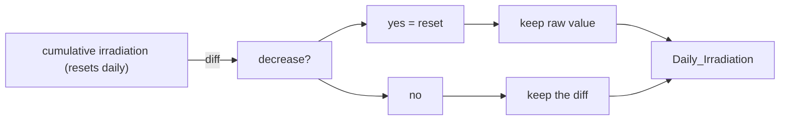
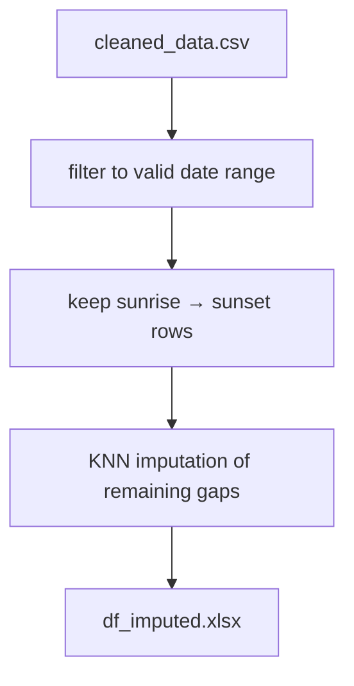
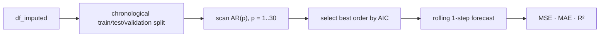

# ☀️ Solar Forecasting Research Pipeline

Experimental forecasting work for solar plant DC power generation, built around a clean data pipeline, exploratory analysis, and time-series modeling.


---

## 🧭 Project focus

The goal is to forecast DC power output from sensor and weather data through a repeatable pipeline:

raw export → cleaning → exploratory analysis → preprocessing → forecasting


Each step is captured in a numbered notebook under `notebooks/`, and the notebooks are intentionally designed to be run sequentially so each stage builds on the previous output. The active workflow includes the main exploratory and forecasting notebooks, while the draft notebooks under `notebooks/drafts/` are ignored by the project git settings and are not part of the main documented pipeline.

| # | Notebook | Input | Output |
|---|----------|-------|--------|
| 1 | `1_Data_Cleaning.ipynb` | `data/raw_data.xlsx` | `data/cleaned_data.csv` |
| 2 | `2_Diagnostic_EDA.ipynb` | `data/cleaned_data.csv` | analysis notes / plots |
| 3 | `3_Preprocessing.ipynb` | `data/cleaned_data.csv` | `data/df_imputed.xlsx` |
| 4 | `4_Post_Processing_EDA.ipynb` | `data/df_imputed.xlsx` | analysis notes / plots |
| 5 | `5_AR.ipynb` | `data/df_imputed.xlsx` | AR forecast + metrics |
| 6 | `6_ARX.ipynb` | `data/df_imputed.xlsx` | ARX forecast + metrics |
| 7 | `7_ARMAX.ipynb` | `data/df_imputed.xlsx` | ARMAX forecast + metrics |

> ⚠️ The raw export is not stored in this repository. Add your own `raw_data.xlsx` under `data/` before running notebook 1.
> The `notebooks/drafts/` folder is intentionally excluded from the main workflow and is not part of the active path.

---

## 1️⃣ Data cleaning — raw signals to a usable table

The cleaning stage normalizes the raw plant export into a consistent time-series table:

- remove empty columns and duplicate rows
- rename French sensor labels into readable English names
- coerce mixed values to numeric types and convert `--` into `NaN`
- reconstruct daily irradiation values from the cumulative sensor signal

This is important because the plant reports cumulative irradiation that resets at midnight, so the raw signal has to be transformed back into per-step values before modeling.



---

## 2️⃣ Diagnostic EDA — understand the data before fitting a model

The exploratory analysis is designed to catch problems before deciding on preprocessing.


Key finding: DC power output is legitimately near zero outside daylight hours; those are real values, not missing values. Imputing over nighttime periods would distort the signal and weaken the model.

This motivates the main preprocessing decisions:

- restrict the series to meaningful daylight windows
- use a feature-aware imputation strategy instead of a naive fill
- separate true zeros from data gaps

---

## 3️⃣ Preprocessing — apply the fixes before modeling



Sunrise and sunset are computed from the plant coordinates using the `astral` package, which avoids hard-coded assumptions and keeps the daylight cutoff aligned with seasonal changes.

This stage produces a cleaned, imputed dataset that is much more appropriate for forecasting work than the raw export.

---

## 4️⃣ Post-processing EDA — validate the feature set and time-series shape

Before modeling, the project checks whether the variables are stable enough for forecasting.

| Check | Output |
|---|---|
| spread and outliers | `figures/Boxplot.png` |
| distribution shape | `figures/Histograms_and_KDE.png` |
| temporal behavior | rolling statistics and decomposition |
| stationarity | ADF diagnostics |
| correlations | notebook-based pairplot / matrix |

This is a quality control step: if the time series is not well-behaved, the modeling choice should reflect that reality rather than forcing a weak assumption.

---

## 5️⃣ Forecasting — autoregressive modeling

The forecasting notebook evaluates a time-respecting autoregressive setup for DC generation:



The approach is intentionally simple and transparent:

- train, validation, and test splits preserve time order
- AR order is selected empirically using AIC
- forecasts are evaluated on meaningful error metrics

---

## 🗂️ Repository structure

```text
spectra/
├── main.py                    # project entry stub
├── isolarcloud.py             # local utility for plant API access
├── notebooks/
│   ├── 1_Data_Cleaning.ipynb
│   ├── 2_Diagnostic_EDA.ipynb
│   ├── 3_Preprocessing.ipynb
│   ├── 4_Post_Processing_EDA.ipynb
│   ├── 5_AR.ipynb
│   ├── 6_ARX.ipynb
│   ├── 7_ARMAX.ipynb
│   └── drafts/               # ignored in git; experimental scratch work
├── figures/                  # exported visual diagnostics and forecast plots
├── data/                     # raw inputs and cleaned intermediate outputs
├── data_old/                 # earlier versions of the dataset
├── models/                   # trained or experimental model artifacts
├── pyproject.toml            # project configuration
├── requirements.txt          # pip dependency list
├── uv.lock                   # uv-managed lock file
└── README.md
```

---

## 🚀 Getting started

```bash
# recommended
uv sync

# or
pip install -r requirements.txt
```

Then:

1. add your raw plant export in `data/` as `raw_data.xlsx`
2. run the notebooks in order from `1_` to `7_`
3. inspect generated figures and metrics before deciding on the next modeling step
4. treat the notebooks in `drafts/` as experimental scratch work, not the main pipeline

Required dependencies include Python 3.13+, pandas, numpy, scikit-learn, statsmodels, astral, matplotlib, seaborn, and openpyxl.

---
